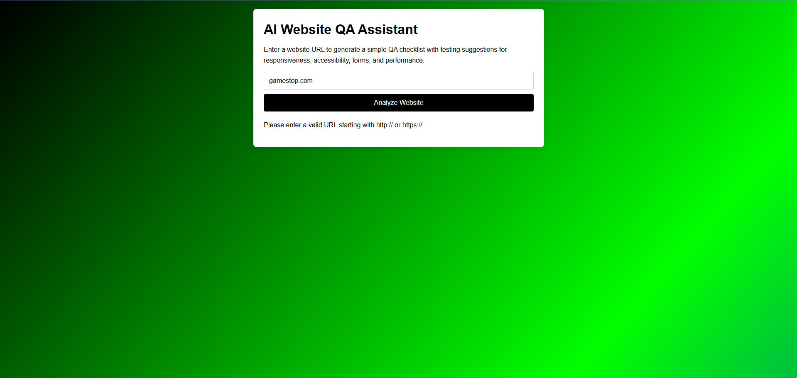

# AI Website QA Assistant

AI Website QA Assistant is a lightweight web tool designed to demonstrate how AI-inspired workflows can help guide website quality assurance testing.

The project allows a user to enter a website URL and receive a structured QA checklist highlighting common areas developers and testers should evaluate before releasing a website.

This tool explores how AI-style prompts and structured suggestions can assist with identifying potential issues related to responsiveness, accessibility, navigation, and performance.

---

## Project Purpose

Modern development teams often use AI tools to assist with debugging, testing workflows, and product reviews. This project explores how AI-generated guidance could help developers and QA testers perform more structured website evaluations.

The assistant generates testing recommendations to help identify potential issues before they impact users.

---

## Features

* Simple interface for entering a website URL
* Responsive design that works across desktop, tablet, and mobile devices
* Dynamic QA checklist generated with JavaScript
* Input validation and user feedback
* Suggestions for common testing areas including UI, responsiveness, and performance

---

## QA Testing Focus

The assistant highlights several key areas commonly reviewed during website testing:

* Navigation and broken links
* Responsive layout behavior
* Accessibility and contrast issues
* Form validation and input behavior
* JavaScript console errors
* Performance audits using Lighthouse

These suggestions are intended to simulate how AI-powered tools could guide developers through structured testing workflows.

---

## Technologies Used

HTML5
CSS3
JavaScript (Vanilla JS)
Responsive Web Design
Chrome DevTools / Lighthouse testing concepts

---

## Example QA Workflow

A typical QA review process suggested by the tool might include:

1. Open Chrome DevTools
2. Inspect the Console for JavaScript errors
3. Test navigation and user flows
4. Resize the viewport to verify responsive layouts
5. Run a Lighthouse performance audit
6. Review accessibility and visual contrast

---

## Screenshot

---

## Future Improvements

Potential improvements for the project include:

* Backend website analysis using Node.js
* Real-time inspection of website HTML structure
* Automated accessibility checks
* Integration with browser testing tools
* AI-generated testing suggestions based on page content

---

## Author

Raevaun Arnum

Frontend developer focused on building responsive web interfaces and exploring tools that improve developer productivity and website quality.

GitHub
https://github.com/CodeBreaker8609

---

## License

MIT License

Copyright (c) 2026 Raevaun Arnum

Permission is hereby granted, free of charge, to any person obtaining a copy
of this software and associated documentation files (the "Software"), to deal
in the Software without restriction, including, without limitation, the rights
to use, copy, modify, merge, publish, distribute, sublicense, and/or sell
copies of the Software, and to permit persons to whom the Software is
furnished to do so, subject to the following conditions:

The above copyright notice and this permission notice shall be included in all
copies or substantial portions of the Software.

THE SOFTWARE IS PROVIDED "AS IS", WITHOUT WARRANTY OF ANY KIND, EXPRESS OR
IMPLIED, INCLUDING BUT NOT LIMITED TO THE WARRANTIES OF MERCHANTABILITY,
FITNESS FOR A PARTICULAR PURPOSE AND NONINFRINGEMENT. IN NO EVENT SHALL THE
AUTHORS OR COPYRIGHT HOLDERS BE LIABLE FOR ANY CLAIM, DAMAGES OR OTHER
LIABILITY, WHETHER IN AN ACTION OF CONTRACT, TORT OR OTHERWISE, ARISING FROM,
OUT OF OR IN CONNECTION WITH THE SOFTWARE OR THE USE OR OTHER DEALINGS IN THE
SOFTWARE.
